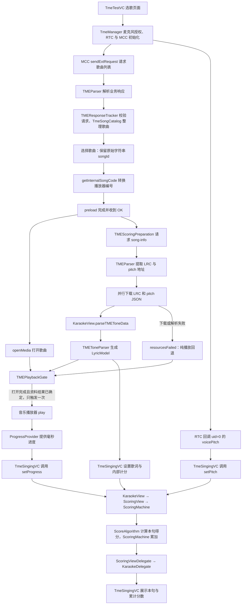

# TME 请求、解析、播放与打分

本图谱以当前工作区源码为依据，包含 SDK、Demo、测试和文档；排除 Pods、Vendor、构建产物与本地账号配置。节点摘要、架构分层和阅读导览均使用中文。历史设计文档用于解释背景，实际行为以源码为准。

## 主流程

## 阅读入口

| 环节 | 源码 | 需要理解的关系 |
| --- | --- | --- |
| 选歌和会话管理 | [TmeTestVC](../Demo/Demo/VC/MainVC/TmeTestVC.swift)、[TmeManager](../Demo/Demo/Other/Utils/TmeManager.swift) | 原始歌曲 ID 用于 TME 业务请求，转换后的内部编号用于预加载和播放器。 |
| 业务响应解析 | [TMEParser](../Demo/Demo/Other/Utils/TMEParser.swift)、[TMEParserModels](../Demo/Demo/Other/Utils/TMEParserModels.swift) | 根据 actionType 解码不同响应，在主线程通知 delegate；解析器本身不发送请求或计算分数。 |
| 计分资料准备 | [TMEScoringPreparation](../Demo/Demo/Other/Utils/TMEScoringPreparation.swift) | song-info 提供 LRC 与 pitch 地址；两个下载都成功后才调用模型解析闭包。 |
| 播放启动条件 | [TMEPlaybackGate](../Demo/Demo/Other/Utils/TMEPlaybackGate.swift) | mediaOpened 与资料成功/失败结果汇合；资料失败可纯播放，播放器打开失败则由管理器停止等待。 |
| 标准音高与歌词 | [TMEToneParser](../AgoraLyricsScore/Class/Other/TMEToneParser.swift)、[Model](../AgoraLyricsScore/Class/Model.swift) | pitch 的 st/d 是毫秒，p 转换为频率；lines 用于展示，scoringLines 只含有效音符的歌词句。 |
| 演唱输入与进度 | [TmeSingingVC](../Demo/Demo/VC/MainVC/TmeSingingVC.swift)、[ProgressProvider](../Demo/Demo/Other/Utils/ProgressProvider.swift) | 本地 voicePitch 经 setPitch 输入；进度约每 20ms 更新并每秒读取播放器校准。Demo 使用 250ms 进度补偿。 |
| 计分和回调 | [KaraokeView](../AgoraLyricsScore/Class/KaraokeView.swift)、[ScoringMachine](../AgoraLyricsScore/Class/Scoring/ScoringMachine/ScoringMachine.swift)、[ScoreAlgorithm](../AgoraLyricsScore/Class/Scoring/Other/ScoreAlgorithm.swift) | 实时音高与标准音高比较；句结束计算音符得分平均值并更新累计值，再由 delegate 返回 UI。 |

## 容易混淆的地方

- 业务 `TMEParser` 与歌词音高 `TMEToneParser` 职责不同，前者处理 MCC 响应，后者生成计分模型。
- 展示行数不一定等于计分行数。标题、词曲署名和没有有效音符的句子不进入 TME 的 `scoringLines`。
- 只有麦克风音高还不能计分，需要模型和毫秒级播放进度共同到位。当前 Demo 通过 `setPitch(..., progressInMs: 0)` 使用视图当前进度。
- 当前 TME 流程使用 `ScoringMachine`；它用自身的 `lineScores` 累计分数。`LineScoreRecorder` 是另外的公共辅助工具，不属于这条默认打分链。
- 切歌或退出会取消资料下载、停止播放门控、重置歌词与进度；requestId、generation、播放器对象与会话标识用于拒绝旧回调。

## 如何使用图谱

`knowledge-graph.json` 是供 `understand-chat` 和可视化面板使用的主产物。面板的阅读导览按 TME 流程组织，可以从歌曲请求一路查看到分数回调，也可以查看测试与对应实现的关联。

Swift 不在当前技能的静态导入解析器支持范围内，Swift 的类、重要函数及调用关系通过源码阅读补充。图谱用于定位和理解架构，不能替代编译器生成的精确调用图；函数行号和节点引用会在保存前校验。

后续代码变化后，重新执行 `understand-anything:understand` 更新图谱；Swift 改动较大或有未提交变更时，建议明确要求 `--full --language zh`。当前任务没有启用 Git 提交时自动更新。
