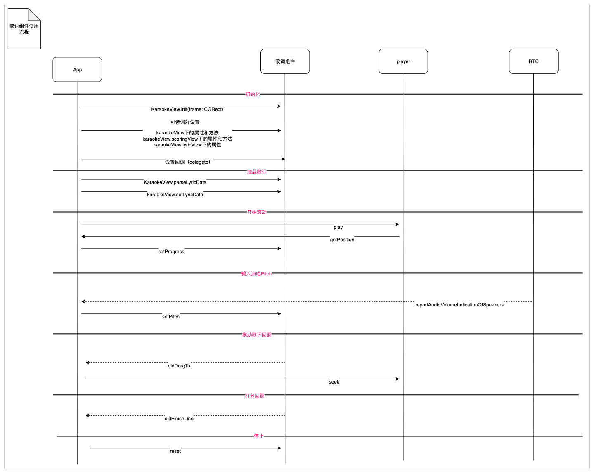

#  KTV歌词解析, 音准评分组件

## 介绍

支持XML歌词解析, LRC歌词解析, 解决了多行歌词进度渲染的问题, 评分根据人声实时计算评分

## 使用方法

#### 1.初始化

```swift
let karaokeView = KaraokeView(frame: .zero, loggers: [ConsoleLogger(), FileLogger()])
karaokeView.frame = ....
view.addSubview(karaokeView)
karaokeView.delegate = self
```
####  2.解析&设置歌词
```swift
let url = URL(fileURLWithPath: filePath)
let data = try! Data(contentsOf: url)
let model = KaraokeView.parseLyricData(data: data)
karaokeView.setLyricData(data: model)
```


####  3.设置进度
```swift
karaokeView.setProgress(progress: progress)
```

#### 4.设置演唱者音调

```swift
karaokeView.setPitch(pitch: pitch)
```

#### 5.重置

```swift
karaokeView.reset()
```

*除以上之外，还可以参考源码中的`MainTestVC.swift`*

## 调用时序



## 对外接口

###  主View：**KaraokeView**

```swift
/// 背景图
@objc public var backgroundImage: UIImage? = nil 

/// 是否使用评分功能
/// - Note: 当`LyricModel.hasPitch = false`，强制不使用
/// - Note: 当为 `false`, 会隐藏评分视图
@objc public var scoringEnabled: Bool = true
    
/// 评分组件和歌词组件之间的间距 默认: 0
@objc public var spacing: CGFloat = 0

@objc public weak var delegate: KaraokeDelegate?
@objc public let lyricsView = LyricsView()
@objc public let scoringView = ScoringView()

/// 解析歌词文件xml数据
/// - Parameter data: xml二进制数据
/// - Returns: 歌词信息
@objc public static func parseLyricData(data: Data) -> LyricModel?

/// 设置歌词数据信息
/// - Parameter data: 歌词信息 由 `parseLyricData(data: Data)` 生成. 如果纯音乐, 给 `.empty`.
@objc public func setLyricData(data: LyricModel?)

/// 重置, 歌曲停止、切歌需要调用
@objc public func reset()

/// 设置实时采集(mic)的Pitch
/// - Note: 可以从AgoraRTC回调方法 `- (void)rtcEngine:(AgoraRtcEngineKit * _Nonnull)engine reportAudioVolumeIndicationOfSpeakers:(NSArray<AgoraRtcAudioVolumeInfo *> * _Nonnull)speakers totalVolume:(NSInteger)totalVolume`  获取
/// - Parameter pitch: 实时音调值
@objc public func setPitch(pitch: Double) 

/// 设置当前歌曲的进度
/// - Note: 可以获取播放器的当前进度进行设置
/// - Parameter progress: 歌曲进度 (ms)
@objc public func setProgress(progress: Int)

/// 同时设置进度和Pitch (建议观众端使用)
/// - Parameters:
///   - pitch: 实时音调值
///   - progress: 歌曲进度 (ms)
@objc public func setPitch(pitch: Double, progress: Int)

/// 设置自定义分数计算对象
/// - Note: 如果不调用此方法，则内部使用默认计分规则
/// - Parameter algorithm: 遵循`IScoreAlgorithm`协议实现的对象
@objc public func setScoreAlgorithm(algorithm: IScoreAlgorithm)

/// 设置打分难易程度(难度系数)
/// - Note: 值越小打分难度越小，值越高打分难度越大
/// - Parameter level: 系数, 范围：[0, 100], 如不设置默认为15
@objc public func setScoreLevel(level: Int)

/// 设置打分分值补偿
/// - Note: 在计算分值的时候作为补偿
/// - Parameter offset: 分值补偿 [-100, 100], 如不设置默认为0
@objc public func setScoreCompensationOffset(offset: Int)
```

### 歌词：**LyricsView**

```swift
/// 无歌词提示文案
@objc public var noLyricTipsText: String 
/// 无歌词提示文字颜色
@objc public var noLyricTipsColor: UIColor
/// 无歌词提示文字大小
@objc public var noLyricTipsFont: UIFont 
/// 是否隐藏等待开始圆点
@objc public var waitingViewHidden: Bool 
/// 正常歌词颜色
@objc public var textNormalColor: UIColor
/// 选中的歌词颜色
@objc public var textSelectedColor: UIColor 
/// 高亮的歌词颜色 （命中）
@objc public var textHighlightedColor: UIColor
/// 正常歌词文字大小
@objc public var textNormalFontSize
/// 高亮歌词文字大小
@objc public var textHighlightFontSize
/// 歌词最大宽度
@objc public var maxWidth: CGFloat
/// 歌词上下间距
@objc public var lyricLineSpacing: CGFloat
/// 等待开始圆点风格
@objc public let firstToneHintViewStyle: FirstToneHintViewStyle
/// 是否开启拖拽
@objc public var draggable: Bool
```

### 评分：**ScoringView**

```swift
/// 评分视图高度
@objc public var viewHeight: CGFloat
/// 渲染视图到顶部的间距
@objc public var topSpaces: CGFloat
/// 游标的起始位置
@objc public var defaultPitchCursorX: CGFloat
/// 音准线的高度
@objc public var standardPitchStickViewHeight: CGFloat
/// 音准线的基准因子
@objc public var movingSpeedFactor: CGFloat
/// 音准线默认的背景色
@objc public var standardPitchStickViewColor: UIColor
/// 音准线匹配后的背景色
@objc public var standardPitchStickViewHighlightColor: UIColor
/** 游标偏移量(X轴) 游标的中心到竖线中心的距离
 - 等于0：游标中心点和竖线中线点重合
 - 小于0: 游标向左偏移
 - 大于0：游标向向偏移 **/
@objc public var localPitchCursorOffsetX: CGFloat
/// 游标的图片
@objc public var localPitchCursorImage: UIImage?
/// 是否隐藏粒子动画效果
@objc public var particleEffectHidden: Bool
/// 使用图片创建粒子动画
@objc public var emitterImages: [UIImage]?
/// 打分容忍度 范围：0-1
@objc public var hitScoreThreshold: Float = 0.7
/// use for debug only
@objc public var showDebugView = false
```

## 事件回调

### **KaraokeDelegate**

```swift
@objc public protocol KaraokeDelegate: NSObjectProtocol {
    /// 拖拽歌词结束后回调
    /// - Note: 当 `KaraokeConfig.lyricConfig.draggable == true` 且 用户进行拖动歌词时候 调用
    /// - Parameters:
    ///   - view: KaraokeView
    ///   - position: 当前时间点 (ms)
    @objc optional func onKaraokeView(view: KaraokeView, didDragTo position: Int)
    
    /// 歌曲播放完一行(Line)时的歌词回调
    /// - Parameters:
    ///   - model: 行信息
    ///   - score: 当前行得分 [0, 100]
    ///   - cumulativeScore: 累计分数
    ///   - lineIndex: 行索引号 最小值：0
    ///   - lineCount: 总行数
    @objc optional func onKaraokeView(view: KaraokeView,
                                      didFinishLineWith model: LyricLineModel,
                                      score: Int,
                                      cumulativeScore: Int,
                                      lineIndex: Int,
                                      lineCount: Int)
}
```

### **分数计算协议**

```swift
@objc public protocol IScoreAlgorithm {
    // MARK: - 自定义分数
    
    /// 计算当前行(Line)的分数
    /// - Parameters:
    ///   - models: 字得分信息集合
    /// - Returns: 计算后的分数 [0, 100]
    @objc func getLineScore(with toneScores: [ToneScoreModel]) -> Int
}
```

<br/>

## 集成方式

### pod引入


```ruby
pod 'AgoraLyricsScore', '~> 1.1.6'"
```
