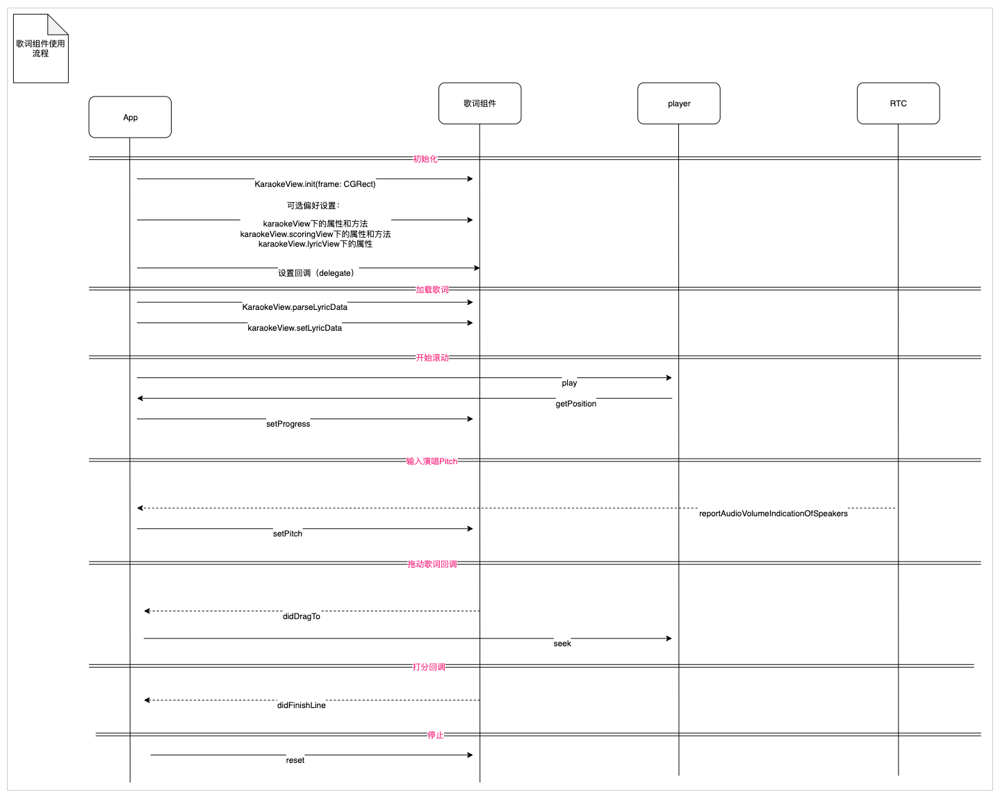

#  KTV歌词解析, 音准评分组件

## 介绍

支持XML/LRC/KRC歌词解析,  可选择根据人声实时计算评分。

## TME用法

TME 接入包括业务响应解析和歌词计分两部分：`TMEParser` 将 MCC 的扩展请求响应转换为歌曲、歌词地址等业务模型；`KaraokeView.parseTMEToneData` 将已下载的 TME pitch JSON 和 LRC 文件合并为 `LyricModel`，再由 `KaraokeView` 根据演唱音高和播放进度计算分数。

### 1. 运行 Demo

1. 将 `Demo/Demo/localConfig.example.swift` 复制为同目录的 `localConfig.swift`，填写 RTC/MCC 的 App ID 和证书，以及需要的 MCC 域名。本地配置已加入 Git 忽略规则。
2. 在 `Demo` 目录执行 `pod install`，然后用 Xcode 打开 `Demo/Demo.xcworkspace`，选择 `Demo` scheme。仓库包含当前 Demo 所需的 Agora SDK 框架。
3. 真机测试时，在 Demo target 的 `Signing & Capabilities` 中选择自己的 Team；如果测试 Bundle ID 不可用，换成唯一的 ID，然后选择连接的 iPhone 并运行。
4. 进入“集成 → TME测试”，允许麦克风权限，选歌后等待歌词和 pitch 下载完成。跟唱时，每句结束后更新本句和累计得分；拒绝授权时，页面会提示到系统设置允许麦克风后重试。

### 2. 准备接入文件和运行环境

在已有 RTC/MCC/音乐播放器的业务中，使用包含本次迁移的 `AgoraLyricsScore` 版本，通过 `import AgoraLyricsScore` 获取 `KaraokeView`、TME 解析器、响应模型和资料准备器。以下公共源码已位于组件目录，会随 CocoaPods 打包；播放门控仍是 Demo 的业务接线示例。

| 文件 | 用途 |
| --- | --- |
| [TMEParserModels.swift](AgoraLyricsScore/Class/TME/TMEParserModels.swift) | TME 业务响应模型 |
| [TMEParser.swift](AgoraLyricsScore/Class/TME/TMEParser.swift) | 异步解析 MCC 扩展响应，按 actionType 分发回调 |
| [TMEScoringPreparation.swift](AgoraLyricsScore/Class/TME/TMEScoringPreparation.swift) | 请求 song-info、下载 LRC/pitch、生成计分模型 |
| [TMEResponseTracker.swift](AgoraLyricsScore/Class/TME/TMEResponseTracker.swift) | 过滤重试、退出后的旧请求及重复回包 |
| [TMEPlaybackGate.swift](Demo/Demo/Other/Utils/TMEPlaybackGate.swift) | 等待播放器打开和计分资料准备结果，再启动播放 |

解析 TME 响应或准备歌词资料时直接使用组件公开接口，无需复制上述公共源码。已有本地 LRC 和 pitch 文件时，可以直接使用第 4 节的模型解析接口；完整下载和播放流程可参考 `TMEPlaybackGate` 的业务门控实现。组件接口说明见 [AgoraLyricsScore/TME.md](AgoraLyricsScore/TME.md)。

```swift
import AgoraLyricsScore
```

开始前，申请麦克风权限，并在应用的 `Info.plist` 设置 `NSMicrophoneUsageDescription`。录音授权成功后启用 RTC 音频，以主播身份加入频道，并用这个 RTC 引擎初始化 MCC。RTC/MCC 使用各自有效的 App ID 和 Token；Demo 的配置入口是 `localConfig.swift`。已有业务可继续使用自己的入会、鉴权和播放器实现。

麦克风请求、拒绝处理及退出时取消等待的示例见 [TMEMicrophonePermissionGate.swift](Demo/Demo/Other/Utils/TMEMicrophonePermissionGate.swift) 和 [TmeManager.swift](Demo/Demo/Other/Utils/TmeManager.swift)。

### 3. 使用 TMEParser 解析业务响应

通过 MCC 的 `sendExtRequest(jsonOption:)` 发送请求。在 `onExtResponse` 回调中，将返回的 `requestId`、原始 `jsonOption`、`httpCode` 和 `response` 传给解析器。解析器在独立串行队列解码，在主线程通知 delegate；它不负责发送网络请求、下载文件或计算分数。

请求中的 `vendorId` 必须为 `2`。例如，用选歌时保留的原始字符串 `songId` 查询歌曲详情：

```swift
let request: [String: Any] = [
    "vendorId": 2,
    "actionType": "song-info",
    "actionParameter": ["songIdListStr": originalSongId]
]
let data = try JSONSerialization.data(withJSONObject: request)
let jsonOption = String(decoding: data, as: UTF8.self)
guard let requestId = mcc.sendExtRequest(jsonOption: jsonOption),
      !requestId.isEmpty else {
    // 请求未提交成功，提示失败并停止等待。
    return
}
// 保存 requestId，用于后续识别当前请求的回调。
```

以下响应处理器可以作为已有管理类的成员长期持有。`delegate` 是弱引用，业务也需要持有处理器，避免它在异步回调前释放。

```swift
final class TMEResponseHandler: TMEParserDelegate {
    private let parser = TMEParser()
    var onSongsResult: ((String, TMESongsResult) -> Void)?
    var onSongInfoResult: ((String, TMESongInfoResult) -> Void)?
    var onError: ((String, TMEParseError) -> Void)?

    init() {
        parser.delegate = self
    }

    func receive(requestId: String, jsonOption: String,
                 httpCode: Int, response: String) {
        parser.parse(requestId: requestId, jsonOption: jsonOption,
                     httpCode: httpCode, responseBody: response)
    }

    func onSongs(_ requestId: String, result: TMESongsResult) {
        onSongsResult?(requestId, result)
    }

    func onSongInfo(_ requestId: String, result: TMESongInfoResult) {
        onSongInfoResult?(requestId, result)
    }

    func onParseError(_ requestId: String, jsonOption: String,
                      responseBody: String, error: TMEParseError) {
        onError?(requestId, error)
    }
}
```

在已有 MCC delegate 的 `onExtResponse` 中调用长期持有的 `responseHandler.receive(requestId:jsonOption:httpCode:response:)`。为 `onSongsResult`、`onSongInfoResult` 和 `onError` 设置自己的处理闭包，并先校验 `requestId` 是否属于当前请求，再更新业务状态。解析器不会替业务过滤旧请求；切歌、退出或重试时要丢弃过期回调，可参考 [TMEResponseTracker.swift](AgoraLyricsScore/Class/TME/TMEResponseTracker.swift)。

支持的 actionType 和成功回调如下；除 `onParseError` 外，delegate 方法都有默认空实现，只需实现业务关心的回调。

| actionType | delegate 回调 | result 类型 |
| --- | --- | --- |
| `songs` | `onSongs` | `TMESongsResult` |
| `search-song` | `onSearchSongs` | `TMESearchSongsResult` |
| `song-info` | `onSongInfo` | `TMESongInfoResult` |
| `song-url` | `onSongUrl` | `TMESongUrlResult` |
| `songlist-page` | `onSonglistPage` | `TMEPageResult` |
| `songlist-detail` | `onSonglistDetail` | `TMEDetailResult` |
| `ranklist-page` | `onRanklistPage` | `TMEPageResult` |
| `ranklist-detail` | `onRanklistDetail` | `TMEDetailResult` |

解析失败通过 `onParseError` 返回：请求 JSON 无效或 vendorId 错误为 `.invalidRequest`，未知 actionType 为 `.unsupportedAction`，非 2xx HTTP 状态为 `.httpStatus`，响应业务 `code != 0` 为 `.apiError`，响应结构无效为 `.invalidResponse`。

### 4. 将 TME LRC 和 pitch 文件转换为计分模型

从匹配原始 `songId` 的 `TMESongDetail` 中取 `pitchUrl`，并从 `lrcList` 选取 `type == "lrc"` 且 URL 非空的条目。完整保留下载地址的查询参数，下载成功后传入本地文件路径：第一个参数是 pitch JSON，第二个参数是 LRC。

```swift
guard let model = KaraokeView.parseTMEToneData(pitchFilePath, lyricFilePath) else {
    // 文件读取或解析失败，或没有可计分的音符。
    return
}
karaokeView.setLyricData(data: model, usingInternalScoring: true)
```

pitch JSON 是音符数组，`st` 为开始时间（毫秒），`d` 为持续时间（毫秒），`p` 为 TME 音高值；这些字段支持数字或数字字符串。例如：

```json
[
  {"st": "1000", "d": "500", "p": "54"},
  {"st": 1600, "d": 300, "p": 56}
]
```

与之配合的 LRC 使用 UTF-8 编码，时间戳支持 1～3 位小数：

```text
[ti:示例歌曲]
[ar:示例歌手]
[00:01.00]第一句歌词
[00:02.00]第二句歌词
```

解析器将 TME 音高转换为计分使用的频率，并按歌词时间分配音符；跨句音符在下一句开始处截断。无音符的歌词仍可显示，标题、作者信息等不参与计分；没有有效计分音符时返回 `nil`。`p` 不是要直接传给 `setPitch` 的实时演唱音高。

### 5. 请求资料、下载并等待播放器打开

`TMEScoringPreparation<LyricModel>` 已封装第 3、4 节的 song-info 请求、响应解析、匹配歌曲、下载和模型生成流程。下面的片段放入已有管理类或控制器中：`mcc` 是绑定入会后 RTC 引擎的 MCC，`player` 是当前歌曲的 MCC 音乐播放器，`karaokeView` 已加入视图，`self` 实现 `KaraokeDelegate`。持有 preparation 和当前歌曲的 playbackGate，所有门控调用及视图更新在主线程执行。

```swift
private let preparation = TMEScoringPreparation<LyricModel> { pitchPath, lyricPath in
    KaraokeView.parseTMEToneData(pitchPath, lyricPath)
}
private var playbackGate: TMEPlaybackGate?
private let responseHandler = TMEResponseHandler()
private var scoringActive = false
private var playing = false
```

保留原始字符串 `originalSongId`。通过 MCC 转换、预加载得到的内部数值 `songCode` 用于播放，不能代替原始 ID 发送 song-info 请求。选歌时可按 Demo 的方式转换并预加载：

```swift
let option: [String: Any] = [
    "vendorId": 2,
    "actionParameter": ["songCode": originalSongId, "fileType": "mkv"]
]
let data = try JSONSerialization.data(withJSONObject: option)
let songCode = mcc.getInternalSongCode(
    songCode: 0, jsonOption: String(decoding: data, as: UTF8.self))
guard songCode >= 0 else { return }
let preloadRequestId = mcc.preload(songCode: songCode)
guard !preloadRequestId.isEmpty else { return }
// 保存 songCode 和 preloadRequestId，过滤非当前歌曲的预加载回调。
```

在当前歌曲的 `onPreLoadEvent` 收到 `.OK` 后，配置资料准备和播放门控，同时请求资料、打开播放器：

```swift
preparation.cancel()
playbackGate?.stop()
let gate = TMEPlaybackGate()
playbackGate = gate
scoringActive = false
playing = false
karaokeView.reset()
karaokeView.isHidden = true
karaokeView.delegate = self

gate.onStart = { [weak self] mode in
    guard let self = self else { return }
    let withScoring = mode == .playWithScoring
    guard self.player.play() == 0 else {
        self.scoringActive = false
        // 提示播放失败并清理当前歌曲。
        return
    }
    self.scoringActive = withScoring
    self.playing = true
    self.karaokeView.isHidden = !withScoring
    // 同步分数区域的显隐；计分播放时启动播放进度更新。
}
preparation.onStatus = { status in
    // 可分别显示 .lyricsDownloaded 和 .pitchDownloaded 等准备状态。
    print("TME 资料状态：\(status)")
}
preparation.onCompletion = { [weak self] result in
    guard let self = self else { return }
    switch result {
    case .success(let model):
        self.karaokeView.setLyricData(data: model, usingInternalScoring: true)
        gate.resourcesReady()
    case .failure(let error):
        self.karaokeView.reset()
        self.karaokeView.isHidden = true
        // 隐藏分数区域，提示资料失败；播放器打开后继续无计分播放。
        print("TME 资料准备失败：\(error)")
        gate.resourcesFailed()
    }
}
preparation.prepare(songId: originalSongId) { jsonOption in
    mcc.sendExtRequest(jsonOption: jsonOption)
}
guard player.openMedia(songCode: songCode, startPos: 0) == 0 else {
    preparation.cancel()
    gate.stop()
    // 提示打开歌曲失败，停止当前歌曲的播放和进度更新。
    return
}
```

已有 MCC delegate 的 `onExtResponse` 先交给 preparation；它只消费当前资料请求，其他业务响应继续交给自己的解析器：

```swift
func onExtResponse(_ requestId: String, jsonOption: String,
                   httpCode: Int, response: String) {
    DispatchQueue.main.async { [weak self] in
        guard let self = self else { return }
        if !self.preparation.handleResponse(requestId: requestId,
                                             jsonOption: jsonOption,
                                             httpCode: httpCode,
                                             response: response) {
            self.responseHandler.receive(requestId: requestId,
                                         jsonOption: jsonOption,
                                         httpCode: httpCode, response: response)
        }
    }
}
```

在当前播放器的 `AgoraRtcMediaPlayer(_:didChangedTo:reason:)` 回调收到 `.openCompleted` 时，主线程调用 `playbackGate?.mediaOpened()`。门控只在“播放器打开 + 资料成功或失败”均有结果后触发一次 `onStart`；因此不能在 `openCompleted` 中另行直接调用 `play()`。

`.failed` 或 `openMedia`/`play` 返回失败属于播放器失败，需要提示并停止歌曲，不能当作计分资料失败继续播放。完整播放器回调和对象校验示例见 [TmeManager.swift](Demo/Demo/Other/Utils/TmeManager.swift)。

### 6. 输入演唱音高、播放进度并接收得分

在 RTC 初始化时启用本地音量回调：

```swift
rtc.enableAudio()
rtc.enableAudioVolumeIndication(200, smooth: 3, reportVad: true)
```

从 `AgoraRtcEngineDelegate` 回调取 `uid == 0` 的本地 `voicePitch`，只在当前歌曲正在计分播放时传入 `KaraokeView`：

```swift
func rtcEngine(_ engine: AgoraRtcEngineKit,
               reportAudioVolumeIndicationOfSpeakers speakers: [AgoraRtcAudioVolumeInfo],
               totalVolume: Int) {
    guard let pitch = speakers.first(where: { $0.uid == 0 })?.voicePitch else { return }
    DispatchQueue.main.async { [weak self] in
        guard let self = self, self.scoringActive, self.playing else { return }
        self.karaokeView.setPitch(speakerPitch: pitch, progressInMs: 0)
    }
}
```

定期读取当前音乐播放器的 `getPosition()`，将非负的毫秒位置在主线程传给 `setProgress`。不要传秒数或系统时间：

```swift
let position = player.getPosition()
if scoringActive, playing, position >= 0 {
    karaokeView.setProgress(progress: UInt(position))
}
```

业务可用自己的进度定时器，也可以复用 Demo 的 [ProgressProvider.swift](Demo/Demo/Other/Utils/ProgressProvider.swift)：它每 20ms 更新、每秒用播放器位置校准。Demo 的演唱页面另外保留了 250ms 的进度补偿；接入现有播放器时应根据自己的音频和歌词同步情况确定是否需要补偿。

实现 `KaraokeDelegate` 并将其设为 `karaokeView.delegate`，每个计分句结束后接收句分及累计分数：

```swift
func onKaraokeView(view: KaraokeView, didFinishLineWith model: LyricLineModel,
                   score: Int, cumulativeScore: Int,
                   lineIndex: Int, lineCount: Int) {
    lineScoreLabel.text = "本句  \(score)"
    totalScoreLabel.text = "累计  \(cumulativeScore) / \(lineCount * 100)"
}
```

`score` 为当前句的 0～100 分，`cumulativeScore` 是累计分数，`lineCount` 是参与计分的句数。TME 模型中没有音符的句子不会产生计分回调；播放刚开始或处于前奏时，不一定立即出现分数。用于显示游标的 pitch 和用于计分的进度都需要持续更新。

### 7. 暂停、切歌、退出和失败处理

暂停时调用播放器 `pause()`，成功后将 `playing` 设为 `false` 并暂停进度更新；`resume()` 成功后恢复播放标记和进度。`.playBackCompleted` 或 `.playBackAllLoopsCompleted` 时停止进度及音高输入。

切歌或退出时，在主线程取消旧资料请求、停用旧门控和播放器，并重置视图：

```swift
playing = false
scoringActive = false
preparation.cancel()
playbackGate?.stop()
playbackGate = nil
player.stop()
karaokeView.reset()
// 停止进度定时器，清空当前 requestId、songId、songCode 和分数显示。
```

`cancel()` 会使当前资料准备失效，取消正在下载的两份资料，并删除该次准备使用的临时目录。切歌或退出时应调用；继续等待当前歌曲准备结果时不要取消。每首歌创建新的门控。切歌时还应为播放器重新建立回调归属（Demo 为每首歌创建新播放器，并销毁旧播放器），核对回调中的播放器对象与当前对象一致；RTC 音高和其他已排队的异步回调可用会话编号过滤，避免旧歌曲数据更新新页面。

| 情况 | 处理方式 |
| --- | --- |
| 麦克风未授权 | 请求授权；拒绝后提示到系统设置开启，不启动演唱采集流程 |
| song-info 请求未提交 | preparation 返回 `.requestFailed` |
| song-info 响应无效，缺少匹配歌曲或有效 LRC/pitch | 返回 `.invalidSongInfo` |
| 资料 URL 无效 | 返回 `.invalidURL` |
| 资料下载失败 | 返回 `.downloadFailed` |
| 文件读取或音高/LRC 解析失败 | 返回 `.invalidFiles` |
| 任一计分资料准备失败 | 隐藏歌词和分数并提示原因，播放器打开成功后继续无计分播放 |
| 预加载或播放器失败 | 停止当前歌曲并提示播放错误 |

可运行的完整接线见 [TmeManager.swift](Demo/Demo/Other/Utils/TmeManager.swift)、[TmeTestVC.swift](Demo/Demo/VC/MainVC/TmeTestVC.swift) 和 [TmeSingingVC.swift](Demo/Demo/VC/MainVC/TmeSingingVC.swift)。简版流程另见 [Demo/TME_SCORING.md](Demo/TME_SCORING.md)。

## 使用方式1: 配合AograMusicContentCenter

#### 1.初始化

```swift
let karaokeView = KaraokeView(frame: .zero, loggers: [ConsoleLogger(), FileLogger()])
karaokeView.frame = ....
view.addSubview(karaokeView)
karaokeView.delegate = self
```
####  2.解析&设置歌词
```swift
let url = URL(fileURLWithPath: filePath)
let data = try! Data(contentsOf: url)
let model = KaraokeView.parseLyricData(lyricFileData: data, pitchFileData:nil, includeCopyrightSentence:true)
karaokeView.setLyricData(data: model, usingInternalScoring: true)
```


####  3.设置进度
```swift
karaokeView.setProgress(progress: progress)
```

#### 4.设置演唱者音调

```swift
karaokeView.setPitch(speakerPitch: pitch, progressInMs: 0)
```

#### 5.重置

```swift
karaokeView.reset()
```

*除以上之外，还可以参考源码中的`MainTestVC.swift`*

## 调用时序



## 对外接口

###  主View：**KaraokeView**

```swift
/// 背景图
@objc public var backgroundImage: UIImage? = nil 

/// 是否使用评分功能
/// - Note: 当`LyricModel.hasPitch = false`，强制不使用
/// - Note: 当为 `false`, 会隐藏评分视图
@objc public var scoringEnabled: Bool = true
    
/// 评分组件和歌词组件之间的间距 默认: 0
@objc public var spacing: CGFloat = 0

@objc public weak var delegate: KaraokeDelegate?
@objc public let lyricsView = LyricsView()
@objc public let scoringView = ScoringView()

/// 解析歌词文件
/// - Parameters:
///   - lyricFileData: 歌词文件的内容（xml、krc、lrc）
///   - pitchFileData: pitch文件的内容
///   - includeCopyrightSentence: 句子是否需要包含版本信息(只在pitchFileData不为空，且krc类型歌词有效)
/// - Returns: 歌词信息
@objc public static func parseLyricData(lyricFileData: Data,
                                        pitchFileData: Data? = nil,
                             includeCopyrightSentence: Bool = true) -> LyricModel?

/// 设置歌词数据信息
/// - Parameter data: 歌词信息 由 `parseLyricData(data: Data)` 生成. 如果纯音乐, 给 `nil`.
/// - Parameter usingInternalScoring: 是否需要歌词组件内部计算打分, 当`data`为`nil`，此值忽略。
@objc public func setLyricData(data: LyricModel?, usingInternalScoring: Bool)

/// 重置, 歌曲停止、切歌需要调用
@objc public func reset()

/// 设置实时音高
/// - Note: 获取方式1. 从Agora RTC 回调方法`reportAudioVolumeIndicationOfSpeakers` 获取speakerPitch.
/// - Note: 获取方式2. 可以从AgoraContentCenterEx回调方法 `onPitch`[该回调频率是50ms/次] 获取speakerPitch.
/// - Parameter speakerPitch: 演唱者的实时音高值
/// - Parameter progressInMs: 当前音高、得分对应的实时进度（ms）.方式1给0.
@objc public func setPitch(speakerPitch: Double, progressInMs: UInt)

/// 设置当前歌曲的进度
/// - Note: 可以获取播放器的当前进度进行设置
/// - Parameter progress: 歌曲进度 (ms)
@objc public func setProgress(progress: Int)

/// 设置自定义分数计算对象
/// - Note: 如果不调用此方法，则内部使用默认计分规则
/// - Parameter algorithm: 遵循`IScoreAlgorithm`协议实现的对象
@objc public func setScoreAlgorithm(algorithm: IScoreAlgorithm)

/// 设置打分难易程度(难度系数)
/// - Note: 值越小打分难度越小，值越高打分难度越大
/// - Parameter level: 系数, 范围：[0, 100], 如不设置默认为15
@objc public func setScoreLevel(level: Int)

/// 设置打分分值补偿
/// - Note: 在计算分值的时候作为补偿
/// - Parameter offset: 分值补偿 [-100, 100], 如不设置默认为0
@objc public func setScoreCompensationOffset(offset: Int)
```

### 歌词：**LyricsView**

```swift
/// 无歌词提示文案
@objc public var noLyricTipsText: String 
/// 无歌词提示文字颜色
@objc public var noLyricTipsColor: UIColor
/// 无歌词提示文字大小
@objc public var noLyricTipsFont: UIFont 
/// 是否隐藏等待开始圆点
@objc public var waitingViewHidden: Bool 
/// 正常歌词颜色
@objc public var textNormalColor: UIColor
/// 选中的歌词颜色
@objc public var textSelectedColor: UIColor 
/// 高亮的歌词颜色 （命中）
@objc public var textHighlightedColor: UIColor
/// 正常歌词文字大小
@objc public var textNormalFontSize
/// 高亮歌词文字大小
@objc public var textHighlightFontSize
/// 歌词最大宽度
@objc public var maxWidth: CGFloat
/// 歌词上下间距
@objc public var lyricLineSpacing: CGFloat
/// 等待开始圆点风格
@objc public let firstToneHintViewStyle: FirstToneHintViewStyle
/// 是否开启拖拽
@objc public var draggable: Bool
```

### 评分：**ScoringView**

```swift
/// 评分视图高度
@objc public var viewHeight: CGFloat
/// 渲染视图到顶部的间距
@objc public var topSpaces: CGFloat
/// 游标的起始位置
@objc public var defaultPitchCursorX: CGFloat
/// 音准线的高度
@objc public var standardPitchStickViewHeight: CGFloat
/// 音准线的基准因子
@objc public var movingSpeedFactor: CGFloat
/// 音准线默认的背景色
@objc public var standardPitchStickViewColor: UIColor
/// 音准线匹配后的背景色
@objc public var standardPitchStickViewHighlightColor: UIColor
/** 游标偏移量(X轴) 游标的中心到竖线中心的距离
 - 等于0：游标中心点和竖线中线点重合
 - 小于0: 游标向左偏移
 - 大于0：游标向向偏移 **/
@objc public var localPitchCursorOffsetX: CGFloat
/// 游标的图片
@objc public var localPitchCursorImage: UIImage?
/// 是否隐藏粒子动画效果
@objc public var particleEffectHidden: Bool
/// 使用图片创建粒子动画
@objc public var emitterImages: [UIImage]?
/// 打分容忍度 范围：0-1
@objc public var hitScoreThreshold: Float = 0.7
/// use for debug only
@objc public var showDebugView = false
```

## 事件回调

### **KaraokeDelegate**

```swift
@objc public protocol KaraokeDelegate: NSObjectProtocol {
    /// 拖拽歌词结束后回调
    /// - Note: 当 `KaraokeConfig.lyricConfig.draggable == true` 且 用户进行拖动歌词时候 调用
    /// - Parameters:
    ///   - view: KaraokeView
    ///   - position: 当前时间点 (ms)
    @objc optional func onKaraokeView(view: KaraokeView, didDragTo position: Int)
    
    /// 歌曲播放完一行(Line)时的歌词回调
    /// - Parameters:
    ///   - model: 行信息
    ///   - score: 当前行得分 [0, 100]
    ///   - cumulativeScore: 累计分数
    ///   - lineIndex: 行索引号 最小值：0
    ///   - lineCount: 总行数
    @objc optional func onKaraokeView(view: KaraokeView,
                                      didFinishLineWith model: LyricLineModel,
                                      score: Int,
                                      cumulativeScore: Int,
                                      lineIndex: Int,
                                      lineCount: Int)
}
```

### **分数计算协议**

```swift
@objc public protocol IScoreAlgorithm {
    // MARK: - 自定义分数
    
    /// 计算当前行(Line)的分数
    /// - Parameters:
    ///   - models: 字得分信息集合
    /// - Returns: 计算后的分数 [0, 100]
    @objc func getLineScore(with toneScores: [ToneScoreModel]) -> Int
}
```


## 使用方式2: 配合AograMusicContentCenterEx

关于AograMusicContentCenterEx的集成，可以参考demo代码文件：`MccManagerEx.swift`

关于歌词组件`KaraokeView`可以参考demo代码文件：`MainView.swift`和`MainTestVC.swift`


## 集成方式

### pod引入


```ruby
pod 'AgoraLyricsScore', '~> 2.2.0'"
```
