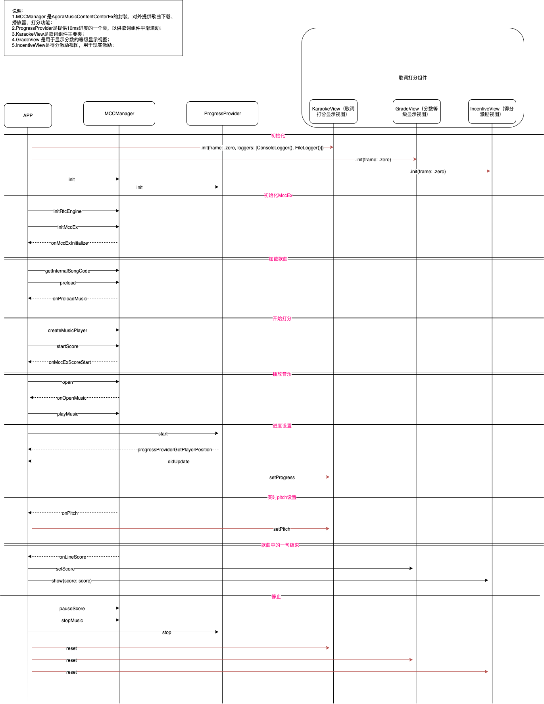

#  KTV歌词解析, 音准评分组件

## 介绍

仅支持KRC歌词解析, 动态显示歌词和打分。


## 使用方法

#### 1.初始化

```swift
let karaokeView = KaraokeView(frame: .zero, loggers: [ConsoleLogger(), FileLogger()])
karaokeView.frame = ....
view.addSubview(karaokeView)
karaokeView.delegate = self
```
####  2.解析&设置歌词
```swift
let lyricData = Data()
let pitchData = Data()
let model = KaraokeView.parseLyricData(krcFileData: lyricData, pitchFileData: pitchData, includeCopyrightSentence: false)
karaokeView.setLyricData(data: model)
```


####  3.设置进度
```swift
karaokeView.setProgress(progress: progress)
```

#### 4.设置演唱者音调

```swift
setPitch(speakerPitch: speakerPitch, progressInMs: progressInMs)
```

#### 5.重置

```swift
karaokeView.reset()
```

*除以上之外，还可以参考源码中的`MainTestVC.swift`*

## 调用时序



## 对外接口

###  主View：**KaraokeView**

```swift
/// 背景图
@objc public var backgroundImage: UIImage? = nil 

/// 是否使用评分功能
/// - Note: 当`LyricModel.hasPitch = false`，强制不使用
/// - Note: 当为 `false`, 会隐藏评分视图
@objc public var scoringEnabled: Bool = true
    
/// 评分组件和歌词组件之间的间距 默认: 0
@objc public var spacing: CGFloat = 0

@objc public weak var delegate: KaraokeDelegate?
@objc public let lyricsView = LyricsView()
@objc public let scoringView = ScoringView()

/// 解析歌词文件krc
/// - Parameters:
///   - krcFileData: krc文件的内容
///   - pitchFileData: pitch文件的内容
///   - includeCopyrightSentence: 是否需要包含版本信息类型的句子
/// - Returns: 歌词信息
@objc public static func parseLyricData(krcFileData: Data,
                                      pitchFileData: Data,
                           includeCopyrightSentence: Bool = true) -> LyricModel?

/// 设置歌词数据信息
/// - Parameter data: 歌词信息 由 `parseLyricData(data: Data)` 生成. 如果纯音乐, 给 `.empty`.
@objc public func setLyricData(data: LyricModel?)

/// 设置实时采集(mic)的Pitch
/// - Note: 可以从AgoraRTC DRM回调方法 `onPitch`[该回调频率是50ms/次]  获取
/// - Parameter speakerPitch: 演唱者的实时音高值
/// - Parameter progressInMs: 当前音高、得分对应的实时进度（ms）
@objc public func setPitch(speakerPitch: Double, progressInMs: UInt)

/// 设置当前歌曲的进度
/// - Note: 可以获取播放器的当前进度进行设置
/// - Parameter progress: 歌曲进度 (ms)
@objc public func setProgress(progress: Int)

/// 重置, 歌曲停止、切歌需要调用
@objc public func reset()
```

### 歌词：**LyricsView**

```swift
/// 无歌词提示文案
@objc public var noLyricTipsText: String 
/// 无歌词提示文字颜色
@objc public var noLyricTipsColor: UIColor
/// 无歌词提示文字大小
@objc public var noLyricTipsFont: UIFont 
/// 是否隐藏等待开始圆点
@objc public var waitingViewHidden: Bool 
/// 正常歌词颜色
@objc public var textNormalColor: UIColor
/// 选中的歌词颜色
@objc public var textSelectedColor: UIColor 
/// 高亮的歌词颜色 （命中）
@objc public var textHighlightedColor: UIColor
/// 正常歌词文字大小
@objc public var textNormalFontSize
/// 高亮歌词文字大小
@objc public var textHighlightFontSize
/// 歌词最大宽度
@objc public var maxWidth: CGFloat
/// 歌词上下间距
@objc public var lyricLineSpacing: CGFloat
/// 等待开始圆点风格
@objc public let firstToneHintViewStyle: FirstToneHintViewStyle
/// 是否开启拖拽
@objc public var draggable: Bool
```

### 评分：**ScoringView**

```swift
/// 评分视图高度
@objc public var viewHeight: CGFloat
/// 渲染视图到顶部的间距
@objc public var topSpaces: CGFloat
/// 游标的起始位置
@objc public var defaultPitchCursorX: CGFloat
/// 音准线的高度
@objc public var standardPitchStickViewHeight: CGFloat
/// 音准线的基准因子
@objc public var movingSpeedFactor: CGFloat
/// 音准线默认的背景色
@objc public var standardPitchStickViewColor: UIColor
/// 音准线匹配后的背景色
@objc public var standardPitchStickViewHighlightColor: UIColor
/** 游标偏移量(X轴) 游标的中心到竖线中心的距离
 - 等于0：游标中心点和竖线中线点重合
 - 小于0: 游标向左偏移
 - 大于0：游标向向偏移 **/
@objc public var localPitchCursorOffsetX: CGFloat
/// 游标的图片
@objc public var localPitchCursorImage: UIImage?
/// 是否隐藏粒子动画效果
@objc public var particleEffectHidden: Bool
/// 使用图片创建粒子动画
@objc public var emitterImages: [UIImage]?
/// use for debug only
@objc public var showDebugView = false
```

## 事件回调

### **KaraokeDelegate**

```swift
@objc public protocol KaraokeDelegate: NSObjectProtocol {
    /// 拖拽歌词结束后回调
    /// - Note: 当 `KaraokeConfig.lyricConfig.draggable == true` 且 用户进行拖动歌词时候 调用
    /// - Parameters:
    ///   - view: KaraokeView
    ///   - position: 当前时间点 (ms)
    @objc optional func onKaraokeView(view: KaraokeView, didDragTo position: Int)
}
```

## 集成方式

### pod引入


```ruby
pod 'AgoraLyricsScore', '~> 2.0.0.130-beta-1'
```
