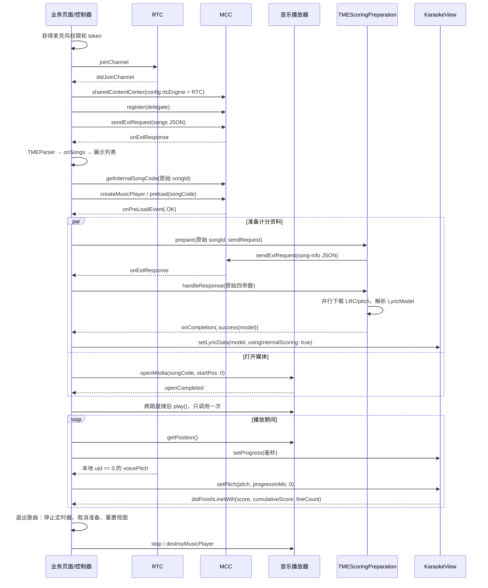

# iOS TME 歌曲播放、歌词与内置打分接入参考

本文面向需要在自己的 iOS 应用中接入 TME 选歌、播放、歌词、音高与逐句计分的开发者。按本文顺序接入后，可以实现与本仓库“TME测试”相同的调用链；页面可以自行设计，也可以复用 Demo 的演唱面板。

接口依据：本仓库截至 2026-10-09 的代码及 `Demo/Vendor/AgoraRtcEngine_iOS` 中的实际 SDK 头文件。文中的 Swift 签名以这一组依赖为准。

## 1. 接入结果与职责边界

完整链路是：申请麦克风权限 → RTC 入会 → 初始化绑定 RTC 的 MCC → 请求 TME 歌曲列表 → 选择歌曲并预加载 → 同时打开媒体、准备歌词与音高 → 安装歌词模型 → 播放 → 持续输入进度与本地音高 → 接收逐句得分 → 停止和清理。

| 对象/组件 | 来源 | 接入方用它做什么 |
| --- | --- | --- |
| `AgoraRtcEngineKit` | `AgoraRtcKit` | RTC 入会、采集麦克风、通过音量回调提供本地 `voicePitch` |
| `AgoraMusicContentCenter` | `AgoraRtcKit` | 绑定 RTC，发送 TME 请求，转换歌曲编号、预加载、创建音乐播放器 |
| `AgoraMusicPlayerProtocol` | `AgoraRtcKit` | `openMedia`、播放、暂停、恢复、读取媒体进度、停止 |
| `TMEParser` / `TMEParserDelegate` | `AgoraLyricsScore` 公开接口 | 将 `onExtResponse` 原始回包解码为歌曲列表等响应模型 |
| `TMEResponseTracker` | `AgoraLyricsScore` 公开接口 | 过滤旧请求、重复回包和重试后迟到的结果 |
| `TMEScoringPreparation<LyricModel>` | `AgoraLyricsScore` 公开接口 | 发送 `song-info`，选择歌词/pitch URL，下载、落盘、解析并返回模型 |
| `KaraokeView` | `AgoraLyricsScore` 公开接口 | 组合歌词与音高 UI，接收进度/实时音高，并提供内部计分 |
| `KaraokeDelegate` | `AgoraLyricsScore` 公开接口 | 接收逐句分和累计分 |
| `GradeView`、`LineScoreView`、`IncentiveView` | `ScoreEffectUI` | 展示累计分/等级、句分动画和激励效果；不负责计算分数 |
| `TMEPlaybackGate` | Demo 业务代码 | 等待媒体打开和资料准备结束，只触发一次播放 |
| `ProgressProvider` / `GCDTimer` | Demo 业务代码 | 每 20ms 推进歌词时间，并周期性向播放器校准 |
| `TMEMicrophonePermissionGate` | Demo 业务代码 | 防止重复权限申请，并隔离退出后迟到的授权结果 |
| `KaraokePanelView` | Demo 业务 UI | 与“内置打分”共用的演唱面板 |
| `TmeManager`、`TmeTestVC`、`TmeSingingVC` | Demo 业务封装 | 展示 SDK 与上述组件如何协作，可参考其实现，不是 SDK API |

业务可以自行实现播放门控、定时器和页面，不需要复制 `TmeManager` 或 Demo 的账号配置。已经有 RTC/MCC/player 的应用，可以保留自己的对象，从第 5 节开始接入。`TMEScoringPreparation` 不创建、不销毁这些对象，也不直接控制播放。

## 2. 依赖和运行条件

### 2.1 依赖安装

本仓库的可验证依赖配置如下。在 `Demo` 目录使用它时，路径与现有 Podfile 一致：

```ruby
target 'Demo' do
  use_frameworks!
  pod 'AgoraRtcEngine_iOS', :path => 'Vendor/AgoraRtcEngine_iOS'
  pod 'AgoraLyricsScore', :path => '../AgoraLyricsScore.podspec'
  pod 'ScoreEffectUI', '1.0.3'
  pod 'RTMTokenBuilder', '1.0.2'  # 仅用于复现 Demo 的本地 token 生成
end
```

```bash
cd Demo
pod install
open Demo.xcworkspace
```

自己的工程需要将两个本地路径改为实际位置，并将 target 名称改为自己的 target。使用已发布的 `AgoraLyricsScore` 时，必须确认该版本包含 `TMEParser`、`TMEResponseTracker`、`TMEScoringPreparation` 和 `KaraokeView.parseTMEToneData`。当前 podspec 标注为 `2.1.7-beta-3`，仅凭这个版本号不能确认远端同名版本已包含仓库中的新增接口。

本地 RTC 包的 podspec 标注为 `4.5.0`，这是仓库内 vendored SDK 的包装版本。接入方应使用包含以下实际接口的兼容 SDK：`AgoraMusicContentCenterConfig.rtcEngine`、`sendExtRequest(jsonOption:)`、`onExtResponse`、返回字符串 requestId 的 `preload(songCode:)`。不要只按版本号判断是否兼容，也不要将旧的 `preload(songCode:jsonOption:)` 整数返回值当作新版 requestId。

Demo 当前最低运行版本为 iOS 13，使用 UIKit、Swift 5。`ScoreEffectUI` 是可选展示层；只需要歌词、音高与计分时可以不引入它。

### 2.2 账号、环境、权限

| 配置 | 用途与匹配要求 |
| --- | --- |
| RTC App ID、RTC token | token 与 RTC App ID、channel、入会 uid 匹配 |
| channel、RTC uid | 同一业务会话使用一致的频道及本地用户编号 |
| MCC App ID、MCC token | MCC 项目需具有对应 TME 曲库访问能力；Demo 使用 RTM token2 |
| MCC uid | 与生成 MCC token 时使用的用户字符串对应；可以与 RTC uid 不同 |
| MCC domain | 使用该账号对应的接入环境；本次 TME 测试使用 `api-test.agora.io` |
| 麦克风权限 | 用于取得演唱者实时音高；在 Info.plist 添加 `NSMicrophoneUsageDescription` |

不要把测试域名作为所有应用的固定配置。生产环境使用服务提供方分配的域名；不要自行在 App ID、token 与服务环境之间混用配置。

Demo 从 `Demo/Demo/localConfig.swift` 读取本地配置，模板是 [localConfig.example.swift](../Demo/Demo/localConfig.example.swift)。参考文档不包含真实 App ID、证书、token 或带签名的资源 URL。

业务 App 由自己的服务端签发并提供 RTC/MCC token。Demo 中 `TokenBuilder.rtcToken2(...)` 和 `TokenBuilder.buildRtmToken2(...)` 是本地调试路径，App Certificate 留在业务服务端。长时间会话还需处理 token 更新；对应 SDK 的 RTC/MCC 均有 token 更新接口，接入时按自己所用 SDK 的签名处理。

## 3. 总体时序



计分资料准备失败时，先隐藏歌词和分数区域，再通知播放门控按“无计分播放”继续等待媒体打开。预加载、打开或播放失败时，显示播放错误并停止本次会话。

## 4. RTC 与 MCC 初始化

以下片段按真实 Demo 调用顺序拆开说明，不是彼此独立的完整类。它们共享同一个业务控制器持有的 `rtc`、`mcc`、`player`、parser、preparation 和歌曲状态。`rtcAppId`、`rtcToken`、`channelId`、`rtcUid`、`mccAppId`、`mccToken`、`mccUid`、`mccDomain` 是业务配置值；`self` 是相应 SDK delegate。可编译的完整业务接线见第 14 节的源文件索引。

### 4.1 先取得麦克风权限

```swift
import AVFoundation

func ensureMicrophone(_ completion: @escaping (Bool) -> Void) {
    switch AVAudioSession.sharedInstance().recordPermission {
    case .granted:
        completion(true)
    case .denied:
        completion(false)
    case .undetermined:
        AVAudioSession.sharedInstance().requestRecordPermission { allowed in
            DispatchQueue.main.async { completion(allowed) }
        }
    @unknown default:
        completion(false)
    }
}
```

从主线程调用。允许后启动 RTC，拒绝时展示权限提示，等待用户在系统设置中授权后重试。Demo 的 `TMEMicrophonePermissionGate` 还处理连续重试和退出后的迟到结果；接入方复用它时应在退出调用 `cancel()`。

### 4.2 创建 RTC 并入会

```swift
import AgoraRtcKit

let config = AgoraRtcEngineConfig()
config.appId = rtcAppId
config.audioScenario = .chorus
config.channelProfile = .liveBroadcasting
let engine = AgoraRtcEngineKit.sharedEngine(with: config, delegate: self)
rtc = engine

engine.enableAudio()
engine.enableAudioVolumeIndication(200, smooth: 3, reportVad: true)
engine.setClientRole(.broadcaster)

let options = AgoraRtcChannelMediaOptions()
options.clientRoleType = .broadcaster
let rc = engine.joinChannel(byToken: rtcToken,
                            channelId: channelId,
                            uid: rtcUid,
                            mediaOptions: options)
// rc == 0 表示提交成功；非 0 时报告错误，不继续初始化 MCC。
```

实现 `AgoraRtcEngineDelegate.rtcEngine(_:didJoinChannel:withUid:elapsed:)`。在它确认入会后，转到主线程，检查回调的 engine 仍是业务当前持有的 RTC、初始化会话未退出/重启，再初始化 MCC。不要将 `joinChannel` 的同步返回 0 当作已经入会。当前 Demo 只在该回调中检查 `mcc == nil`；接入自己的应用时需要补充上述初始化身份检查，详见第 12 节。

### 4.3 用同一个 RTC 初始化 MCC

```swift
let config = AgoraMusicContentCenterConfig()
config.rtcEngine = rtc
config.appId = mccAppId
config.token = mccToken
config.mccUid = mccUid
if let domain = mccDomain, !domain.isEmpty { config.mccDomain = domain }

guard let center = AgoraMusicContentCenter.sharedContentCenter(config: config) else {
    // 展示 MCC 初始化失败并停止本次初始化。
    return
}
mcc = center
center.register(self)
// 接下来发送歌曲列表请求。
```

实现 `AgoraMusicContentCenterEventDelegate`，持有 center 和 delegate。`register` 只使用最后注册的事件委托；若业务已有 MCC delegate，在该委托中分发响应，避免另一个对象注册后覆盖原委托。

## 5. 请求和展示歌曲列表

### 5.1 发送 songs 请求

结构化构造 JSON，避免手工拼接歌曲 ID 或查询字段：

```swift
func jsonString(_ object: [String: Any]) -> String? {
    guard let data = try? JSONSerialization.data(withJSONObject: object),
          let text = String(data: data, encoding: .utf8) else { return nil }
    return text
}

let request: [String: Any] = [
    "vendorId": 2,
    "actionType": "songs",
    "actionParameter": ["queryInfo": "", "limit": 20]
]
guard let json = jsonString(request),
      let requestId = mcc.sendExtRequest(jsonOption: json),
      !requestId.isEmpty else {
    // 请求未提交；显示错误，提供重试。
    return
}
songsRequest.set(requestId)
```

本段 `mcc` 是已确认初始化成功的 center。Demo 请求 20 条，只取前 6 首非空 ID 的歌曲显示；“6 首”是 Demo 的 UI 策略，不是 `TMEParser` 或 SDK 的返回上限。

### 5.2 转交原始回包并过滤旧请求

业务持有以下对象，并在初始化时执行 `responseParser.delegate = self`：

```swift
private let songsRequest = TMEResponseTracker()
private let responseParser = TMEParser()
```

MCC 的回包先尝试交给第 7 节的资料准备器，没有消费的回包再交给列表解析器：

```swift
func onExtResponse(_ requestId: String, jsonOption: String,
                   httpCode: Int, response: String) {
    DispatchQueue.main.async { [weak self] in
        guard let self = self else { return }
        if !self.scoringPreparation.handleResponse(
            requestId: requestId, jsonOption: jsonOption,
            httpCode: httpCode, response: response
        ) {
            self.responseParser.parse(requestId: requestId, jsonOption: jsonOption,
                                      httpCode: httpCode, responseBody: response)
        }
    }
}
```

`requestId`、`jsonOption`、`httpCode`、`response` 四个原始参数原样转交。`TMEParser` 用请求里的 `vendorId` / `actionType` 决定响应模型，不要用另一个请求的 JSON，也不要自行假定所有响应都是歌曲列表。

实现 `TMEParserDelegate`，处理 `onSongs` 和 `onParseError`：

```swift
func onSongs(_ requestId: String, result: TMESongsResult) {
    songsRequest.deliverIfCurrent(requestId) { isStillCurrent in
        let songs = result.songList.filter { !$0.songId.isEmpty }
        // 将 songs 的 songId、songName、artistList 映射到自己的列表并更新 UI。
        // 本闭包中若 UI 更新重入并发起新请求，后续旧状态更新前应再判断：
        guard isStillCurrent() else { return }
        // 更新“请选择歌曲”或“暂无歌曲”状态。
    }
}

func onParseError(_ requestId: String, jsonOption: String,
                   responseBody: String, error: TMEParseError) {
    songsRequest.deliverIfCurrent(requestId) { _ in
        // 展示 error 的分类和必要错误码；允许重试。
    }
}
```

列表重试前 `songsRequest.clear()`，新请求成功提交后 `set(newRequestId)`，退出 TME 时再 `clear()`。Tracker 只过滤回调，不取消已经提交的 SDK 网络请求。

## 6. 选歌、转换编号和预加载

### 6.1 分别保存两种歌曲编号

| 标识 | 类型 | 来源 | 使用位置 |
| --- | --- | --- | --- |
| 原始 TME `songId` | `String` | `TMESongDetail.songId` | 播放参数中的 `songCode` 字段、资料准备的 `prepare(songId:)` |
| MCC 内部 `songCode` | `Int` | `getInternalSongCode(...)` 返回值 | `preload(songCode:)`、`openMedia(songCode:startPos:)` |
| 预加载 `requestId` | `String` | `preload(songCode:)` 返回值 | 匹配 `onPreLoadEvent` |
| 列表/资料 `requestId` | `String` | 各次 `sendExtRequest(...)` 返回值 | 匹配对应 `onExtResponse`；各流程单独保存 |

原始 ID 必须保持字符串原值，包括可能的前导零或非数字字符。不要转换成 Int 再转换回字符串。

### 6.2 为当前歌曲创建播放器并预加载

选歌前停止旧歌曲、取消旧资料请求和计时，并重置歌词/分数。Demo 为每首歌创建一个新的 MCC music player，方便隔离旧播放器的迟到回调。

```swift
guard let musicPlayer = mcc.createMusicPlayer(delegate: self) else { return }
player = musicPlayer
currentTMESongId = song.id  // song.id 是原始字符串 ID

let option: [String: Any] = [
    "vendorId": 2,
    "actionParameter": ["songCode": song.id, "fileType": "mkv"]
]
guard let json = jsonString(option) else { return }
let code = mcc.getInternalSongCode(songCode: 0, jsonOption: json)
guard code >= 0 else {
    // 编号转换失败，释放本次播放器并展示错误。
    return
}
selectedSongCode = code
let requestId = mcc.preload(songCode: code)
guard !requestId.isEmpty else {
    // 请求未提交，释放本次会话并展示错误。
    return
}
preloadRequestId = requestId
```

上面的 `song` 是业务保存的歌曲条目，可用 Demo 的 `TmeSong(id:name:artist:)`，也可直接使用 `TMESongDetail` 并读取 `song.songId`。JSON 中原始 ID 的字段名为 `songCode`，并不表示要填转换后的整数。`fileType: "mkv"` 与当前 Demo 一致；`getInternalSongCode` 这次调用不需要 `actionType`。

实现 `onPreLoadEvent`，转到主线程后先匹配当前 `requestId` 与内部 `songCode`。非当前结果忽略；`.error` 报告预加载失败；进度状态只更新 UI；第一次 `.OK` 才清除 `preloadRequestId` 并进入下一节，重复 `.OK` 不应再次打开或准备歌曲。

## 7. 并行打开媒体、准备歌词与音高

### 7.1 创建并持有准备器

```swift
import AgoraLyricsScore

let scoringPreparation = TMEScoringPreparation<LyricModel> { pitchPath, lyricPath in
    KaraokeView.parseTMEToneData(pitchPath, lyricPath)
}
```

第一个路径是音高 JSON，第二个路径是 LRC。顺序不能颠倒。接入方不需要自己解码 pitch 的音符值或把 `p` 当作麦克风 Hz；组件的 TME tone parser 负责转换和合并。

设置回调后再开始请求：

```swift
scoringPreparation.onStatus = { status in
    // 主线程，按 status 分别更新歌词和 pitch 的下载状态。
}
scoringPreparation.onCompletion = { [weak self] result in
    guard let self = self else { return }
    switch result {
    case .success(let model):
        self.delegate?.tmeManager(self, didPrepare: model)
        self.playbackGate?.resourcesReady()
    case .failure(let error):
        self.delegate?.tmeManager(self, didPrepare: nil)
        self.delegate?.tmeManager(self, didFailPreparation: error)
        self.playbackGate?.resourcesFailed()
    }
}
```

这一段是 `TmeManager` 的接线方式，`delegate.tmeManager` 是 Demo 自定义委托，不是 `AgoraLyricsScore` 接口。自己的业务可以改成闭包或自己的 delegate；要求成功处理先同步安装模型，失败处理先同步隐藏/重置 UI，之后才通知播放门控。

### 7.2 在匹配的预加载 .OK 后开始两路工作

```swift
scoringPreparation.prepare(songId: originalTMESongId) { option in
    mcc.sendExtRequest(jsonOption: option)
}
let rc = player.openMedia(songCode: internalSongCode, startPos: 0)
// rc != 0：停止本次播放门控，取消准备器，展示媒体打开失败。
```

`prepare` 会内部构造以下请求，业务发送闭包只负责走已初始化的 MCC 通道：

```json
{
  "vendorId": 2,
  "actionType": "song-info",
  "actionParameter": { "songIdListStr": "原始TME歌曲ID" }
}
```

不需要另外向未知 HTTP 地址发 `song-info`，也不需要通过 RTC 的其它请求接口发送它。打开媒体与资料下载可以并行；此时尚未调用 `play()`。

### 7.3 准备器内部做了什么

1. 保存 `sendExtRequest` 返回的 requestId，仅消费属于当前请求的回包。
2. 通过 `TMEParser` 解析 `song-info`，在 `songList` 中查找 `songId` 精确匹配的条目，不依赖返回顺序。
3. 读取非空 `pitchUrl`，并从 `lrcList` 选择 `type == "lrc"` 且 URL 非空的条目。
4. 校验 URL 是带 host 的 HTTP/HTTPS 地址，并原样使用带签名的 URL。组件不按协议重排或改写地址；HTTP 是否可访问仍受应用 ATS 配置限制。
5. 创建本次准备独有的临时目录，并行下载到 `song_pitch.json` 和 `song_lyric.lrc`。HTTP 状态需为 2xx，数据非空，再原子写入文件。
6. 两份文件都就绪后调用注入的解析闭包，成功返回 `LyricModel`，失败返回明确错误类别。

状态枚举依次涉及 `requestingSongInfo`、`downloadingLyrics`、`lyricsDownloaded`、`downloadingPitch`、`pitchDownloaded`、`parsing`。两份下载完成的顺序不固定；页面应分别保存两份资源的状态。

`cancel()` 会丢弃旧回调、取消实际下载任务并删除该准备器的临时目录。成功完成后临时目录保留到下一次 `prepare` 或显式 `cancel`；业务在切歌/退出时调用清理。

## 8. 播放门控：模型先安装，媒体后开始

每首歌使用独立门控。以下是 Demo 的 `TMEPlaybackGate` 用法，它是可复用业务源码，不在 `AgoraLyricsScore` 模块内：

```swift
let gate = TMEPlaybackGate()
gate.onStart = { [weak self] mode in
    guard let self = self else { return }
    self.scoringActive = mode == .playWithScoring
    guard musicPlayer.play() == 0 else {
        self.scoringActive = false
        // 展示播放失败并终止本次会话。
        return
    }
    self.isPlaying = true
    self.canTogglePlayback = true
    // 通知页面开始/恢复进度更新。
}
playbackGate = gate
```

播放器委托 `AgoraRtcMediaPlayer(_:didChangedTo:reason:)` 中：

```swift
guard let current = self.player,
      (playerKit as AnyObject) === (current as AnyObject) else { return }

if state == .failed {
    // 停止歌曲、取消准备和门控；显示打开/播放失败。
    return
}
if state == .openCompleted { playbackGate?.mediaOpened() }
```

所有判断转到主线程后执行。`.failed` 不能调用 `resourcesFailed()` 来伪装成无计分播放，因为媒体本身不可用。

| 媒体状态 | 资料状态 | 动作 |
| --- | --- | --- |
| 未打开 | 未结束 | 等待 |
| 已打开 | 未结束 | 等待 |
| 未打开 | 已成功安装模型 | 等待媒体打开 |
| 已打开 | 已成功安装模型 | `play()` 一次，启用计分 |
| 已打开 | 资料失败，UI 已隐藏 | `play()` 一次，不发送计分输入 |
| 打开/播放失败 | 任意 | 终止并提示播放错误 |
| 会话已停止 | 任意迟到回调 | 忽略 |

资料成功后，演唱页面按下面顺序操作：

```swift
karaokePanel.isHidden = false
karaokePanelHeightConstraint?.constant = KaraokePanelView.height
view.layoutIfNeeded()
karaokeView.setLyricData(data: model, usingInternalScoring: true)
// 到这里再由业务通知 gate.resourcesReady()。
```

`karaokePanel` / `karaokePanelHeightConstraint` 是 Demo 的 UI 对象。自行实现页面时，保证 `KaraokeView` 已有正确布局尺寸，再安装模型即可。不要在收到 `.openCompleted` 时直接播放，也不要异步排队安装模型后立刻将门控标记为已就绪。

## 9. 实时进度、麦克风音高和计分结果

### 9.1 持续提供毫秒进度

播放器 `getPosition()` 返回毫秒位置，负数表示无有效位置。计分播放期间需要持续调用：

```swift
let position = player.getPosition()
if position >= 0 {
    let raw = UInt(position)
    let aligned = raw > 250 ? raw - 250 : raw
    karaokeView.setProgress(progress: aligned)
}
```

Demo 使用 `ProgressProvider`：主线程每 20ms 推进一次，每约 1 秒用 `getPosition()` 校准，交给 `KaraokeView` 前沿用 250ms 对齐。20ms 是 UI/计分进度的更新间隔，不是 RTC 音高回调间隔。250ms 是当前 Demo 的对齐策略，接入方可根据自己的播放链路验证延迟，避免重复补偿。

复用 `ProgressProvider` 时，同时带入 `GCDTimer.swift`，实现其三个委托方法：

| 方法 | 接入行为 |
| --- | --- |
| `progressProviderGetPlayerPosition` | 返回有效 player 毫秒位置；无效时返回 nil |
| `progressProvider(_:didUpdate:)` | 当前正在计分播放时，对齐后调用 `setProgress` |
| `progressProvider(_:shouldSend:)` | Demo 留空；需要向其它用户同步进度时接入自己的数据通道 |

首播 `start()`，暂停 `pause()`，恢复 `resume()`，结束/退出 `stop()`。持有 provider 并设置 delegate 后才启动计时器。若自行实现定时器，也应以播放器位置校准，不能长期只累加定时器时间。

### 9.2 提供本地演唱者的音高

`AgoraRtcEngineDelegate` 的本地音量回调中取 `uid == 0` 的 `voicePitch`：

```swift
func rtcEngine(_ engine: AgoraRtcEngineKit,
               reportAudioVolumeIndicationOfSpeakers speakers: [AgoraRtcAudioVolumeInfo],
               totalVolume: Int) {
    guard let pitch = speakers.first(where: { $0.uid == 0 })?.voicePitch else { return }
    // 派发到主线程，并再次核对当前会话、正在播放且启用了计分。
    // 满足条件后：karaokeView.setPitch(speakerPitch: pitch, progressInMs: 0)
}
```

这里的 `uid == 0` 表示音量回调中的本地用户，不是入会时填的 uid。输入来自本地麦克风，不要用伴奏播放器或远端用户的音高代替。

本地 SDK 头文件说明：音量回调 interval 小于 200ms 时按 200ms 处理，正值应为 200 的整数倍。因此当前 Demo 使用 `enableAudioVolumeIndication(200, smooth: 3, reportVad: true)`；不能承诺每 20ms 或每 50ms 得到一份 RTC `voicePitch`。

`progressInMs: 0` 对应 Demo 的 RTC 实时音高输入方式；歌曲时间由 `setProgress` 驱动。暂停、无计分播放、完成或退出后不再输入音高。

### 9.3 接收逐句分和累计分

先设置 `karaokeView.delegate = self`，实现 `KaraokeDelegate`：

```swift
func onKaraokeView(view: KaraokeView, didFinishLineWith model: LyricLineModel,
                   score: Int, cumulativeScore: Int,
                   lineIndex: Int, lineCount: Int) {
    karaokePanel.lineScoreView.showScoreView(score: score)
    karaokePanel.gradeView.setScore(cumulativeScore: cumulativeScore,
                                   totalScore: lineCount * 100)
    karaokePanel.incentiveView.show(score: score)
}
```

`score` 是本句分，`cumulativeScore` 是组件给出的累计分，不需要再自行累加。累计分满分以回调的 `lineCount * 100` 为准；不要用可显示歌词行数推算最终满分，署名/无音高歌词行可能不计分。

组件保留“自然完成句子才回调”的语义，跳过的句子不会补发评分。TME Demo 不启用歌词拖动；自行增加 seek 时需同步播放器位置与进度源，不能只移动 UI。

## 10. 歌词、音高与分数 UI

最小接入只需创建 `KaraokeView`，放入页面并给出非零尺寸：

```swift
let karaokeView = KaraokeView(frame: .zero)
karaokeView.backgroundImage = UIImage(named: "ktv_top_bgIcon")
karaokeView.scoringView.viewHeight = 100
karaokeView.scoringView.topSpaces = 80
karaokeView.lyricsView.draggable = false
karaokeView.delegate = self
```

`ktv_top_bgIcon` 是 Demo 的图片资源，不包含在 `AgoraLyricsScore` 的公开 API 中。复用时带入图片，或者使用自己的深色背景；组件默认正常歌词为白色，浅色底需要同步调整文字颜色。

若希望与当前“内置打分”完全相同，复用 [KaraokePanelView.swift](../Demo/Demo/View/KaraokePanelView.swift) 并引入 `ScoreEffectUI`。面板包括：

- 350pt 高、全宽的 KTV 演唱区域。
- 顶部累计分/等级、100pt 高的音高区及 80pt 顶部预留空间。
- 相同的歌词字号、行距、白色正常歌词和粉色高亮。
- 相同的句分和激励动画布局。

准备成功时展开演唱面板；准备失败时隐藏并将面板占用高度设为 0，重置歌词/等级/激励，只保留播放按钮和失败说明。隐藏普通 UIView 本身不会自动收起其约束高度；当前 Demo 显式改变面板高度约束。

`GradeView`、`LineScoreView`、`IncentiveView` 只消费分数。无计分播放时不要保留上一首歌的这些显示。

## 11. 暂停、结束、切歌和退出

### 11.1 暂停/恢复

只有已进入可播放状态时才能操作。`pause()` / `resume()` 返回 0 后才更新自己的播放状态与进度定时器；失败时保持状态并提示错误。Demo 的 `canTogglePlayback` 就是业务状态标记，不是 SDK 的属性。

### 11.2 正常结束

播放器出现 `.playBackCompleted` 或 `.playBackAllLoopsCompleted` 时：停止进度更新、停止音高输入、禁用恢复按钮，并保留当前最终成绩供查看。返回/切歌时再重置它。

### 11.3 只退出当前歌曲

按当前对象所有权清理：

```swift
progressProvider.stop()
scoringPreparation.cancel()
playbackGate?.stop()
playbackGate = nil
player?.stop()
if let current = player { mcc?.destroyMusicPlayer(current) }
player = nil
preloadRequestId = nil
selectedSongCode = nil
currentTMESongId = nil
karaokeView.reset()
// 同时清除 scoringActive / isPlaying / canTogglePlayback，并重置分数 UI。
```

退回歌曲列表时保留 RTC/MCC，继续用于选择下一首。重新选歌前先走同样的歌曲清理，再创建新的 player 和门控。

### 11.4 退出整个 TME 功能

先取消权限等待、列表 tracker 和当前歌曲，再释放自己拥有的 SDK 对象：

```swift
microphonePermission.cancel()
songsRequest.clear()
// 先完成上面的当前歌曲清理。
mcc?.register(nil)
mcc = nil
AgoraMusicContentCenter.destroy()
rtc?.leaveChannel()
rtc?.disableAudio()
rtc = nil
AgoraRtcEngineKit.destroy()
```

如果 RTC/MCC 是应用其他模块共享的对象，由其所有者统一销毁，歌曲模块只解除自己的回调并释放自己创建的播放器。

## 12. 主线程与异步隔离

| API/回调 | 线程约束 |
| --- | --- |
| `TMEScoringPreparation.prepare`、`handleResponse`、`cancel` | 必须主线程；实现中有 `precondition(Thread.isMainThread)` |
| `TMEScoringPreparation.onStatus` / `onCompletion` | 主线程 |
| `TMEParser.parse` | 可从 SDK 后台回调线程调用；内部串行队列解析 |
| `TMEParserDelegate` 回调 | 异步投递到主线程 |
| `TMEResponseTracker` 的所有访问 | 业务统一在主线程调用 |
| UIKit / `KaraokeView` / score-effect UI 更新 | 主线程 |
| RTC/MCC/player 事件 | 不假定当前线程；派发到主线程处理，具体身份过滤见下文 |

至少隔离三种标识：歌曲列表 requestId、资料准备 requestId、当前歌曲/播放器会话。不能用一个“当前 requestId”同时覆盖列表和计分资料流程。

Demo 通过 `playbackSession` 代数防止旧音高和状态事件落到新页面；播放器回调额外核对对象身份；预加载回调核对 requestId + 内部 songCode；资料准备器内部用 generation 丢弃旧解析/下载回调。接入自己的事件总线或页面框架时需要保留相同效果，尤其应在主线程派发后再次检查身份。

这些保护覆盖歌曲相关流程，不代表 Demo 的全部 RTC 初始化回调已经隔离。当前 `didJoinChannel` 派发到主线程后仅检查 `mcc == nil`；若退出先把 RTC/MCC 清空，迟到的入会回调仍可能再次触发 MCC 初始化。自己的初始化层应核对回调 engine 与当前 RTC 对象身份，并使用独立的初始化会话标识确认未退出或重启，再允许创建 MCC；停止/重启时使旧初始化会话失效。不要只靠 `mcc == nil` 判断是否可继续。

不要在日志记录完整 response body、带签名的资源 URL、token 或证书。诊断通常只需接口动作、错误分类、HTTP/业务错误码和当前请求阶段。

## 13. 失败处理、等待上限与排查

### 13.1 错误分类

| 位置 | 错误/表现 | 业务动作 |
| --- | --- | --- |
| 麦克风权限 | 拒绝授权 | 提示系统设置授权，不继续启动此 Demo 计分流程 |
| RTC/MCC 初始化 | 入会提交失败、RTC 错误、center 创建失败 | 显示初始化错误，停止后重试 |
| 列表提交 | `sendExtRequest` 返回 nil/空字符串 | 显示提交失败，重试 |
| 列表解析 | `invalidRequest`、`unsupportedAction` | 检查 vendorId / actionType / jsonOption 是否对应当前请求 |
| 列表解析 | `httpStatus(code)` | 检查网络、环境和 HTTP 错误；404 时优先核对 MCC domain 与测试/生产环境 |
| 列表解析 | `apiError(code, msg)` | 按业务错误核对账号能力、token、参数和资源权限 |
| 列表解析 | `invalidResponse` | 核对当前 SDK/服务返回的响应结构，不能当成无歌曲 |
| 预加载/媒体 | `.error`、非 0 同步返回、播放器 `.failed` | 终止当前歌曲，展示播放错误 |
| 资料准备 | `requestFailed` | 请求未成功提交，按无计分播放处理 |
| 资料准备 | `invalidSongInfo` | 回包无法解析、找不到匹配歌曲或缺 pitch/LRC，按无计分播放处理 |
| 资料准备 | `invalidURL` | 资源地址无效，按无计分播放处理 |
| 资料准备 | `downloadFailed` | 下载/HTTP/文件写入失败，取消其它下载，按无计分播放处理 |
| 资料准备 | `invalidFiles` | 合并解析返回 nil，按无计分播放处理 |

`TMEScoringPreparation` 对 `song-info` 的 parser 错误统一回报 `invalidSongInfo`，不会把原始 `TMEParseError` 继续暴露在其 completion 中。需要更细诊断时在业务/SDK 回包入口记录不含敏感内容的请求阶段与 HTTP 错误码。

### 13.2 不要把提交成功当作最终成功

`sendExtRequest` / `preload` 返回 requestId，只说明请求已提交；`openMedia` 返回 0，只说明打开操作已接受；实际结果分别来自 `onExtResponse`、`onPreLoadEvent` 和播放器状态回调。

当前 `TMEScoringPreparation` 没有独立的 `song-info` 响应等待计时器，当前 `TMEPlaybackGate` 也没有等待上限。如果服务始终没有回包，仅依赖这两者会一直等待。业务应为列表、预加载、资料等待和媒体打开设置自己的超时策略，记录阶段并允许重试；不要宣称这些 Demo 辅助类已经自动覆盖所有超时。

资料等待超时时，应先核对计时器属于当前歌曲且资料尚未完成，再 `scoringPreparation.cancel()`、隐藏/重置计分 UI，然后 `gate.resourcesFailed()`。媒体随后成功打开时可无计分播放。媒体打开/预加载超时则终止歌曲，不按资料失败降级。任何完成、切歌或退出事件都取消对应业务超时任务，避免计分播放中又触发旧超时处理。

### 13.3 快速定位 UI/计分问题

- 歌词全白或不可见：核对背景和文字颜色、组件布局尺寸，以及 `setLyricData` 是否在页面完成布局后调用。
- 音高区没有有效数据：核对资料是否成功、RTC 音量回调是否启用、是否取了本地 `voicePitch`、是否仍在当前计分播放会话。
- 歌词不滚动/没有句分回调：核对持续 `setProgress`、进度单位为毫秒、暂停状态、`usingInternalScoring: true` 和 `KaraokeDelegate` 是否设置。
- 旧歌曲突然开始播放：核对预加载 requestId、player 对象身份、歌曲会话代数，以及旧门控/下载是否已经停止。
- 资料失败后页面留大片空白：除了 `isHidden`，还要收起容器高度/布局占用。

## 14. 可编译参考源码和复制范围

本文的片段用于说明每步 API 的参数、返回值和衔接关系；完整 delegate 签名和可编译实现以以下源文件为准。自己的业务控制器可以照这些调用自己实现，无需依赖 `TmeManager` 类型。

| 源文件 | 阅读/复用范围 |
| --- | --- |
| [TmeManager.swift](../Demo/Demo/Other/Utils/TmeManager.swift) | RTC/MCC 初始化、songs 请求、编号转换、预加载、响应分发、播放门控、旧会话过滤、对象清理 |
| [TmeTestVC.swift](../Demo/Demo/VC/MainVC/TmeTestVC.swift) | 列表展示、选歌立即导航、切换 manager delegate、返回列表保留 RTC/MCC |
| [TmeSingingVC.swift](../Demo/Demo/VC/MainVC/TmeSingingVC.swift) | 安装模型、资源状态 UI、进度与音高输入、计分回调、演唱页面清理 |
| [TMEPlaybackGate.swift](../Demo/Demo/Other/Utils/TMEPlaybackGate.swift) | 独立的单次播放门控，可带入业务工程 |
| [ProgressProvider.swift](../Demo/Demo/Other/Utils/ProgressProvider.swift) / [GCDTimer.swift](../Demo/Demo/VC/GCDTimer.swift) | Demo 进度定时与校准，可替换成自己的进度提供器 |
| [TMEMicrophonePermissionGate.swift](../Demo/Demo/Other/Utils/TMEMicrophonePermissionGate.swift) | 权限等待和取消隔离，可替换成自己的权限层 |
| [KaraokePanelView.swift](../Demo/Demo/View/KaraokePanelView.swift) | 可选的内置打分同款 UI；带入 `ktv_top_bgIcon` 资源并依赖 `ScoreEffectUI` |
| [TME 公共接口说明](../AgoraLyricsScore/TME.md) | 组件公开接口及支持的 action 类型 |
| [TMEScoringPreparation.swift](../AgoraLyricsScore/Class/TME/TMEScoringPreparation.swift) | 准备器的状态、失败分类、线程要求、取消和下载实现 |
| [KaraokeView.swift](../AgoraLyricsScore/Class/KaraokeView.swift) | TME 文件解析入口、内部计分开关、进度和音高 API |

若直接带入 Demo 辅助代码，它们默认是业务内部类型，不是 Pod 的公开符号。复制为新文件后需加入自己的 target；只 `import AgoraLyricsScore` 不会获得 `TMEPlaybackGate`、`ProgressProvider` 或 `KaraokePanelView`。

`TmeManager` 当前为了独立运行 Demo 自己创建和销毁 RTC/MCC、读取 `Config`。已有 RTC/MCC 的应用应复用其中请求、回调和门控的接线方法，不要照搬它的 SDK 单例销毁行为，也不需要复制 `Config` / `localConfig.swift`。

## 15. 接入验收

按以下顺序完成一次实际设备验证：

1. 授权麦克风，RTC 入会成功，再创建 MCC，能收到歌曲列表。
2. 选歌后能观察当前歌曲的预加载、歌词/pitch 独立下载状态，并收到有效模型。
3. 媒体先打开和资料先成功两种顺序都只播放一次，且模型先于首次播放安装。
4. 歌曲进度、歌词滚动、麦克风实时音高与句分回调工作；累计分用组件返回值，满分用 `lineCount * 100`。
5. 暂停/恢复时进度同步停止/继续；结束后不再输入音高，最终成绩保留。
6. 模拟缺少 pitch/LRC、下载失败或解析失败：提示资料原因并无计分播放；模拟媒体失败：终止且显示播放错误。
7. 快速切歌、重试列表和返回页面，旧回包不能覆盖新状态或再次启动播放。
8. 返回列表保留 RTC/MCC；退出 TME 后取消下载和定时器，按对象所有权释放 SDK。
9. 验证横屏/小屏下等待与失败提示可见，并加入业务侧请求和媒体打开超时。

仓库内已有公开接口与 Demo 接线检查，在仓库根目录执行：

```bash
bash scripts/tests/tme_public_component.sh
bash scripts/tests/tme_sdk_flow.sh
```

前者验证组件公开可见性与解析/准备/请求隔离行为，后者检查 Demo 的 SDK 接线；它们不替代真机在线歌曲及 UI 验证。构建当前 Demo 可使用：

```bash
xcodebuild -workspace Demo/Demo.xcworkspace -scheme Demo -configuration Debug \
  -destination 'generic/platform=iOS' CODE_SIGNING_ALLOWED=NO build
```

无签名构建用于检查编译；安装 iPhone 需要有效 Apple 开发签名和包含目标设备的描述文件。
